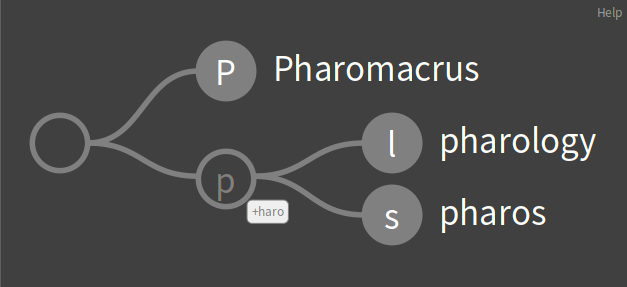

# AdaptiveRadixTree

Adaptive Radix Tree implemented in [Pharo](https://pharo.org).

Implemented as a specialized `Dictionary` and behaves like a proper `Collection`.

See [The Adaptive Radix Tree: ARTful Indexing for Main-Memory Databases](https://db.in.tum.de/~leis/papers/ART.pdf)

## Installation

```smalltalk
Metacello new
  baseline: 'AdaptiveRadixTree';
  repository: 'github://grype/Pharo-AdaptiveRadixTree';
  load.
```

## Examples

```smalltalk
tree := ArtTree new.
tree at: 'hello' put: 'world'.
tree at: 'hello'. "'value'"
tree removeKey: 'hello'.
tree do: [:each | ... ].
tree asDictionary.
tree associations.
```

```smalltalk
t := ArtTree new.
stream := '/usr/share/dict/words' asFileReference readStream.

[ stream atEnd ] whileFalse: [ 
	stream nextLine ifNotEmpty: [ :line | t at: line put: line ].
	].
t size. "235886"

selection := t select: [ :each | each asLowercase beginsWith: 'pharo' ].
selection size. "3"

(ArtNode gtMapViewBuilder value: selection root) inspect.
```


